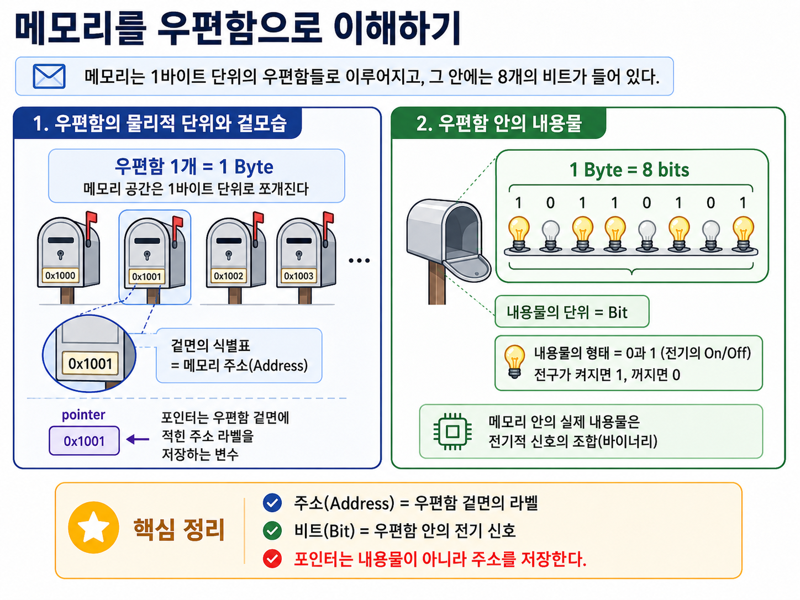
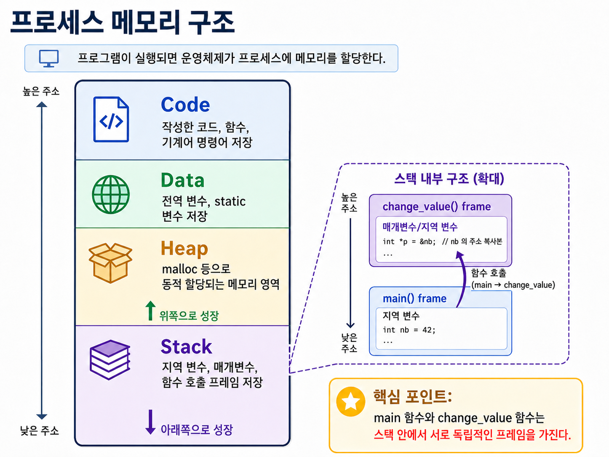

# C언어 포인터(Pointers)

## 1. 컴퓨터와 메모리의 이해 (모든 것의 시작)

포인터를 이해하려면 컴퓨터가 데이터를 어떻게 저장하는지 먼저 알아야 합니다.

- **컴퓨터의 본질:** CPU는 '초고속 계산기'이고, RAM(메모리)은 '숫자를 적어두는 방대한 노트'입니다.
- **RAM의 구조:** 메모리는 1바이트(8비트) 단위의 '우편함'들로 이루어져 있으며, 각 우편함에는 고유한 주소(Address)가 있습니다.

- **데이터 타입의 역할:**
  - `int`, `float`, `char` 등의 데이터 타입은 메모리에서 얼마나 많은 공간(크기)을 차지할지 결정합니다.
  - 공간 크기뿐만 아니라, 비트를 어떻게 해석할지(인코딩 방식)도 결정합니다. 
  (예: 정수 42와 실수 42.0의 바이너리 구조는 완전히 다름)

---

## 2. 프로세스 메모리 구조

프로그램이 실행(Process)되면 운영체제는 메모리를 할당해 줍니다.

> `main` 함수에서 `change_value`라는 다른 함수를 호출할 때, 두 함수는 스택 내에서 서로 **독립적인 프레임(공간)** 을 가집니다.

1. **Code:** 기계어 명령어(작성한 코드, 함수 등)가 저장되는 곳.
2. **Data:** 전역 변수, 정적(static) 변수가 저장되는 곳.
3. **Heap:** `malloc` 등으로 동적 할당되는 자유로운 메모리 영역.
4. **Stack:** 지역 변수와 함수 호출 프레임(Function Frame)이 쌓이는 곳. **우리가 다루는 일반적인 변수들은 모두 여기에 쌓입니다.**


### Heap은 언제 사용하는가

Heap은 컴파일 시점이 아니라 **프로그램 실행 중에 필요한 메모리 크기가 결정될 때** 사용합니다.

- 배열 크기를 실행 중 입력값에 따라 정해야 할 때
- 함수가 끝난 뒤에도 메모리를 계속 유지해야 할 때
- Stack에 올리기에는 큰 데이터를 다뤄야 할 때
- 연결 리스트, 트리, 큐처럼 노드를 필요할 때마다 만들고 없애는 자료구조를 만들 때

```c
#include <stdlib.h>

void make_numbers(int count)
{
    int *numbers = malloc(sizeof(int) * count);

    if (numbers == NULL) {
        return;
    }

    free(numbers);
}
```

> **주의**
> Heap에 할당한 메모리는 자동으로 사라지지 않습니다. `malloc`으로 할당했다면 더 이상 필요 없을 때 반드시 `free`로 해제해야 합니다.

---

## 3. 포인터의 본질과 Pass by Reference

- **문제점 (Pass by Value):** 다른 함수에 변수를 넘겨줄 때, C언어는 기본적으로 값을 '복사'해서 전달합니다. 따라서 호출된 함수에서 값을 바꿔도 원본 함수(`main`)의 변수에는 아무런 영향이 없습니다.

> **해결책 (포인터):** 변수의 복사본이 아니라, 원본이 있는 '주소'를 알려주면 됩니다!

- **연산자 정리:**
  - `&` (주소 연산자): "이 변수의 메모리 주소가 뭐야?"
  - `*` (역참조 연산자, Dereference): "이 주소로 직접 찾아가서 값을 읽거나 써라!" (멀리 있는 곳을 참조한다는 의미)

### Pass by Value

```c
#include <stdio.h>

void change_value(int num)
{
    num = 20;
}

int main(void)
{
    int value = 10;

    change_value(value);

    printf("%d\n", value);  // 10

    return 0;
}
```

`change_value(value)`를 호출하면 `value` 자체가 넘어가는 것이 아니라 `10`이라는 값이 복사되어 `num`에 들어갑니다. 그래서 `num`을 20으로 바꿔도 `main` 함수의 `value`는 그대로 10입니다.

### 포인터로 원본 값 바꾸기

```c
#include <stdio.h>

void change_value(int *num)
{
    *num = 20;
}

int main(void)
{
    int value = 10;

    change_value(&value);

    printf("%d\n", value);  // 20

    return 0;
}
```

`&value`는 `value`의 주소를 의미합니다. `change_value` 함수는 그 주소를 `int *num`으로 받고, `*num = 20`을 통해 해당 주소에 있는 원본 값을 직접 바꿉니다.

---

## 4. 포인터의 크기와 데이터 타입 (가장 많이 하는 질문)

### Q. 가리키는 데이터가 크면 포인터의 크기도 커지나요?

> **A. 아닙니다!** 엠파이어 스테이트 빌딩의 주소나, 동네 핫도그 가게의 주소나 '주소의 길이'는 똑같습니다. 포인터는 주소를 담는 변수일 뿐이므로, 가리키는 대상이 `char`(1바이트)이든 거대한 `struct`(메가바이트 단위)이든 **포인터 자체의 크기는 동일**합니다. (64비트 운영체제 기준 보통 8바이트)

### Q. 크기가 다 똑같은데, 왜 굳이 `int*`, `float*` 처럼 타입을 명시하나요?

> **A. 주소로 찾아간 다음 "어떻게 행동할지"를 컴파일러에게 알려주기 위해서입니다.**

1. **데이터 해석:** 해당 주소부터 몇 바이트를 읽어들일지, 그리고 그 비트들을 정수로 해석할지 실수로 해석할지 결정합니다.
2. **포인터 연산 (Pointer Arithmetic):** `ptr + 1`을 했을 때, `char*`는 1바이트만 이동하지만, `int*`는 4바이트, `short*`는 2바이트를 건너뜁니다! (가리키는 자료형의 크기 단위로 점프)

---

## 5. Void 포인터 (`void *`)

아직 배역이 정해지지 않은 엑스트라 배우(Generic Pointer)라고 생각하면 됩니다.

> **주의**
> 타입을 모르기 때문에 직접 역참조(`*ptr`)하거나 포인터 연산(`ptr++`)을 할 수 없습니다. 반드시 원하는 타입으로 **캐스팅(Casting)** 한 뒤 사용해야 합니다.

- 가리키는 데이터의 **타입(크기와 해석 방식)을 모르는 상태**입니다.
- 가장 대표적인 예가 메모리만 덩그러니 할당해 주는 `malloc` 함수의 반환값입니다.

---

## 6. 배열과 포인터의 이중성 (시험 단골 출제 구역)

> "배열은 포인터인가요?" ➡️ 정답: "아닙니다. 하지만 포인터처럼 행동(Decay)합니다."

배열의 이름은 대부분의 수식에서 '배열의 첫 번째 원소를 가리키는 포인터'로 강등(Decay)됩니다.

> **예외**
> **강등(Decay)의 예외 3가지!** 이때는 배열 그 자체로 취급됩니다.

1. `sizeof(배열이름)`: 포인터 크기(8)가 아니라 배열 전체의 크기 반환.
2. `&배열이름`: 첫 번째 원소의 주소가 아니라, '배열 전체를 가리키는 주소' 반환 (타입이 달라짐).
3. 문자열 리터럴로 초기화할 때.

### Syntactic Sugar (문법적 설탕)

우리가 흔히 쓰는 `배열[i]` 형태는 사실 컴파일러가 보기 좋게 만들어준 껍데기입니다.

- `arr[5]` ➡️ 컴파일러는 이를 `*(arr + 5)`로 번역합니다.
- **충격적인 사실:** 덧셈은 교환법칙이 성립하므로 `*(5 + arr)`도 똑같습니다. 즉, `5[arr]`라고 코딩해도 완벽하게 정상 작동합니다! (물론 이렇게 짜면 욕먹습니다)

---

## 7. 심화: 이중 포인터와 함수 포인터

### 1. 이중 포인터 (Pointer to Pointer): `ptr**`

- 포인터 변수도 결국 메모리 공간(Stack)을 차지하는 변수일 뿐입니다.
- 따라서 포인터 변수의 주소를 가리키는 또 다른 포인터를 만들 수 있습니다.
- `main` 함수의 매개변수인 `char argv`가 대표적인 예입니다. (문자열(char*)들의 배열을 가리키는 포인터)

### 2. 함수 포인터 (Function Pointer)

> **주의**
> `int (*ptr)(int, int)`처럼 괄호를 반드시 쳐야 "정수 2개를 받고 정수를 반환하는 함수를 가리키는 포인터"로 인식됩니다. 괄호가 없으면 포인터를 반환하는 함수로 인식됩니다.

- 우리가 만든 함수들도 메모리의 **Text(Code) 영역**에 저장된 명령어들의 집합입니다.
- 변수 이름처럼, **'함수의 이름' 역시 해당 함수 명령어가 시작되는 메모리 주소**를 의미합니다.
- 이를 활용해 다른 함수의 인자로 함수 자체를 넘겨줄 수 있습니다. (콜백 함수 등의 구현에 사용)

---

## 참고 자료

- [Pointers in C for Absolute Beginners – Full Course](https://www.youtube.com/watch?v=MIL2BK02X8A)
